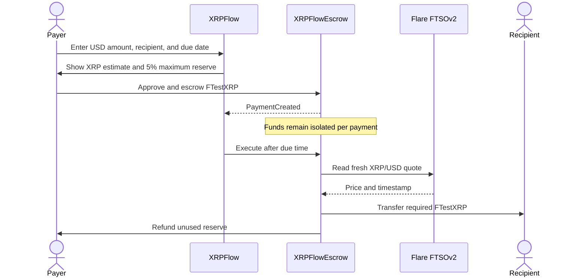

# XRPFlow

XRPFlow is a treasury workspace for scheduling USD-denominated payments that settle in FTestXRP/FXRP on Flare. A payer escrows a maximum XRP amount, the final payout is calculated from Flare's FTSOv2 XRP/USD feed when the payment becomes due, and unused reserve is returned immediately.

Live demo: https://xrpflow.huanghar.workers.dev

Source code: https://github.com/huangharen/xrpflow-flare

The project is being built for the [**Flare Summer Signal Hackathon**](https://dorahacks.io/hackathon/flaresummersignal/detail) under the **Interoperable Asset Products** track. Final submissions close August 14, 2026.

## Hackathon contribution boundary

The event permits new projects and meaningful extensions of existing work. This repository makes the hackathon contribution auditable through its commit history. Work completed for the event includes:

- the complete XRPFlow product interface and responsive payment workflow;
- `XRPFlowEscrow` with isolated liabilities, reserve top-ups, cancellation, expiry refunds, and permissionless execution;
- live FTSOv2 XRP/USD resolution through `FlareContractRegistry`;
- real/demo state separation and Coston2 transaction/event hydration;
- 13 contract behavior tests, SSR checks, architecture, security, and submission documentation;
- Cloudflare Workers production deployment through Wrangler.

The product does not claim FAssets minting/redemption as newly implemented. It uses FTestXRP on Coston2 to demonstrate the settlement mechanics safely.

## What the prototype proves

- USD-denominated payment instructions can settle in an XRP-based asset without hiding exchange-rate risk.
- Every instruction has an explicit payer, recipient, due time, expiry, reserve, and reference.
- FTSOv2 determines the settlement amount at execution time.
- A 5% reserve buffer caps the payer's exposure; a payment cannot overdraw its escrow.
- Anyone may execute a due payment. Only the payer may cancel before it is due; after expiry, anyone may trigger a refund that is always paid to the payer.
- Coston2 FTestXRP is labeled as a test asset throughout the interface. The app never presents demo records as real transactions.

## Product surfaces

- **Overview** — available balance, reserved funds, claimable payments, oracle status, and contract status.
- **Payments** — searchable payment instructions with settlement and transaction details.
- **New payment** — address, USD amount, due date, reference, live quote, estimated payout, and maximum reserve.
- **Activity** — a compact event ledger with explorer links.
- **Settings** — exact Coston2, FTestXRP, registry, oracle, and reserve configuration.

The interface runs in two explicit modes:

1. **Demo workspace** works without a wallet and uses labeled sample records.
2. **Coston2 contract mode** activates after a wallet is connected and `NEXT_PUBLIC_TREASURY_ADDRESS` plus `NEXT_PUBLIC_TREASURY_DEPLOY_BLOCK` point to a deployed `XRPFlowEscrow` contract.

## Settlement flow



## Network configuration

| Setting | Value |
| --- | --- |
| Network | Flare Testnet Coston2 |
| Chain ID | `114` |
| RPC | `https://coston2-api.flare.network/ext/C/rpc` |
| Explorer | `https://coston2-explorer.flare.network` |
| Gas token | `C2FLR` |
| FTestXRP | `0x0b6A3645c240605887a5532109323A3E12273dc7` |
| FlareContractRegistry | `0xaD67FE66660Fb8dFE9d6b1b4240d8650e30F6019` |
| XRP/USD feed ID | `0x015852502f55534400000000000000000000000000` |

FTestXRP has six decimals and no monetary value. The deploy script resolves FTSOv2 through `FlareContractRegistry` instead of hardcoding an oracle address.

## Run locally

Requirements: Node.js 22.13 or newer.

```bash
npm ci
npm run dev
```

Open `http://localhost:3000`.

The demo workspace needs no environment variables. To enable live contract transactions:

```bash
cp .env.example .env
```

Then set `NEXT_PUBLIC_TREASURY_ADDRESS` and `NEXT_PUBLIC_TREASURY_DEPLOY_BLOCK` to the values printed by the deploy script, and restart the development server. The block value keeps event queries inside the public RPC range limit.

## Test and build

```bash
npm run check
```

`npm run check` runs ESLint, strict TypeScript checking, the production-profile contract build, 13 contract behavior tests, the production web build, and two server-rendered HTML checks. Use `npm run test:contracts`, `npm run typecheck`, or `npm run test:web` separately while iterating.

The contract tests cover:

- escrow accounting and backing;
- exact and rounded-up USD-to-XRP conversion;
- settlement and reserve refund;
- permissionless execution and execution-time boundaries;
- price movement beyond the reserve;
- top-up and post-expiry top-up rejection;
- payer-only cancellation;
- permissionless expiry refunds that always return funds to the payer;
- multi-payment accounting isolation;
- zero, future, and stale oracle quotes;
- repeated settlement prevention.

## Deploy the contract to Coston2

Use a dedicated testnet wallet. Never reuse a wallet that controls real assets.

1. Get C2FLR from the [Flare faucet](https://faucet.flare.network/coston2).
2. Copy `.env.example` to `.env` and set `COSTON2_PRIVATE_KEY`.
3. Build and deploy:

```bash
npm run contracts:build
npm run contracts:deploy:coston2
```

4. Copy the printed contract address and deployment block into `NEXT_PUBLIC_TREASURY_ADDRESS` and `NEXT_PUBLIC_TREASURY_DEPLOY_BLOCK`.

The deploy script refuses to run unless the connected chain ID is `114`, verifies the payment token reports `FTestXRP` with six decimals, and resolves FTSOv2 from the registry.

## Contract design

`XRPFlowEscrow` has no owner, proxy, or administrative withdrawal path. Each payment is fully escrowed and tracked separately. The core invariant is:

```text
contract FTestXRP balance >= sum of every unsettled payment escrow
```

The contract uses OpenZeppelin `SafeERC20`, `ReentrancyGuard`, and `Math.mulDiv` with upward rounding. Quotes with a zero value, a future timestamp, or an age above five minutes are rejected.

See [docs/ARCHITECTURE.md](docs/ARCHITECTURE.md) for the full model and [SECURITY.md](SECURITY.md) for reporting and limitations.

## Repository map

```text
app/                    Product interface and Coston2 wallet integration
contracts/              XRPFlowEscrow and test mocks
scripts/deploy.ts       Guarded Coston2 deployment
test/                   Solidity behavior tests
tests/                  Rendered application checks
docs/                   Architecture, demo script, and submission checklist
.openai/hosting.json    Cloudflare-compatible hosting configuration
```

## Current limits

- The prototype schedules one-time payments; recurring payroll is not included.
- Execution is permissionless but not automatically triggered by a keeper.
- FAssets minting and redemption remain separate from the payment contract.
- Demo records are local presentation data and are not read from the chain.
- Mainnet deployment requires a separate review, verified addresses, and an external security assessment.

## License

[MIT](LICENSE)
